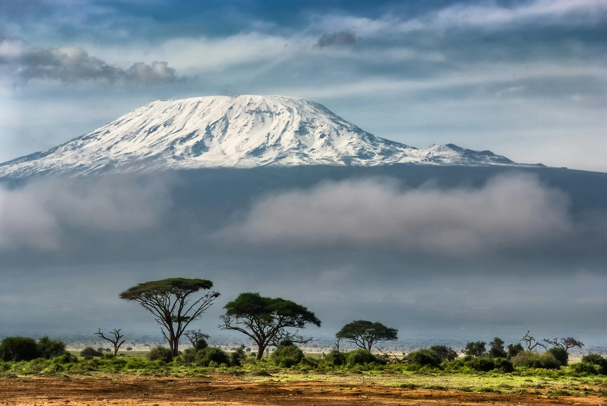
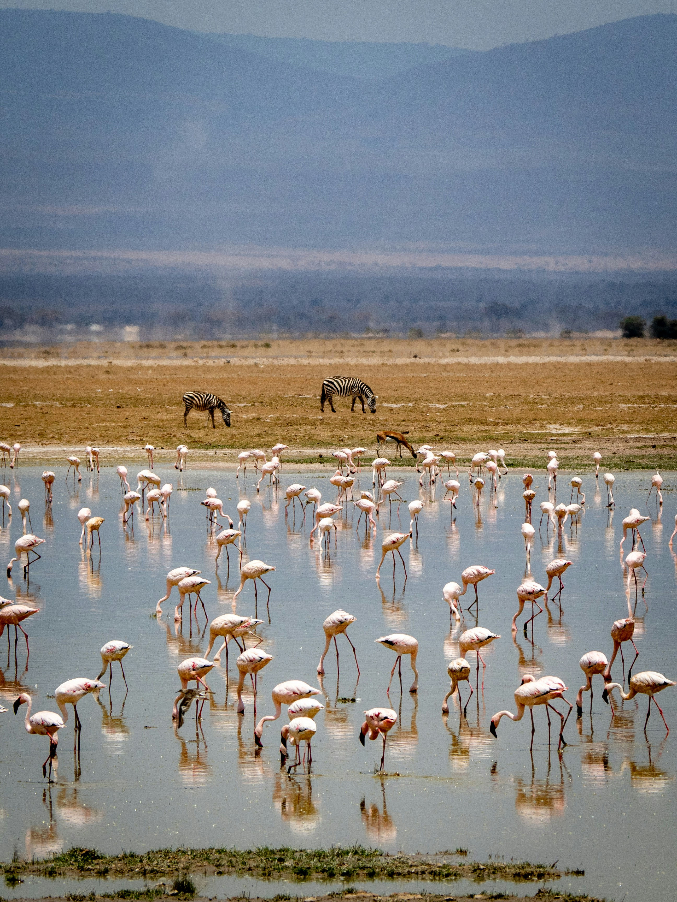

### Overview

Amboseli is small, flat, and open, with Kilimanjaro rising just across the border in Tanzania. It is one of the best places in Kenya to spend time with elephants. The herds have been studied continuously for decades, so the population is unusually well documented and many elephants are calm around vehicles.

### Landscape

Dust plains and a seasonally dry lakebed broken by permanently green swamps, fed by water filtering underground from Kilimanjaro. Yellow-fever acacia woodland and Observation Hill rise above the surrounding flats.

### Wildlife

Large elephant herds, including some of Kenya's biggest-tusked bulls. Buffalo, zebra, wildebeest, giraffe, hippo in the swamps, spotted hyena, lion, and cheetah are also present, though the predators are less concentrated than in the Mara. The wetlands attract excellent birdlife, including pelicans, herons, and occasional flamingos. There are no rhino in Amboseli.

### Activities

Game drives, sundowners from Observation Hill, wetland birding, visits to Maasai communities, and photography planned around views of Kilimanjaro.

### When to go, and why

June to October and January to February are the drier periods and usually offer the clearest views of the mountain. Kilimanjaro is often most visible at first light and again late in the day, with cloud building by mid-morning. The timing matters because you are planning around the mountain as much as the weather.

### Sample experiences

An early drive positioned for elephants crossing open ground with Kilimanjaro behind them. A late afternoon on Observation Hill as the light settles across the swamps.
