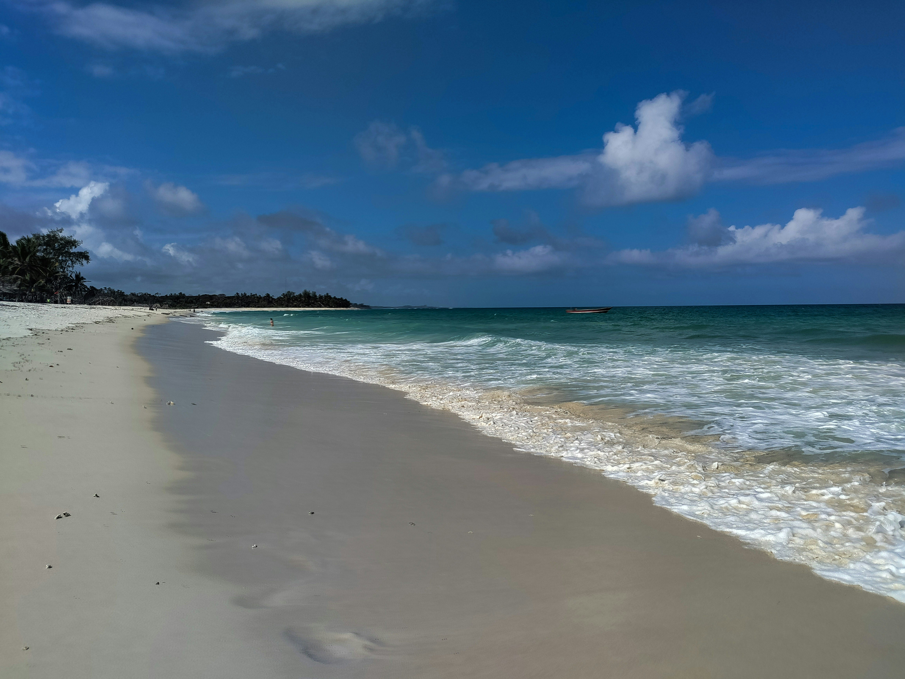
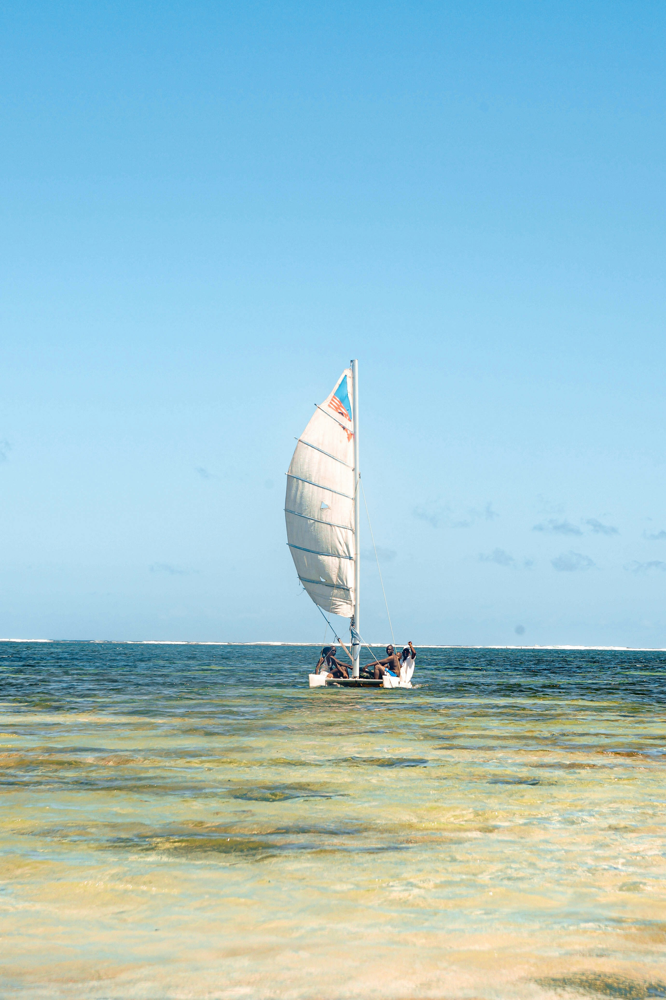
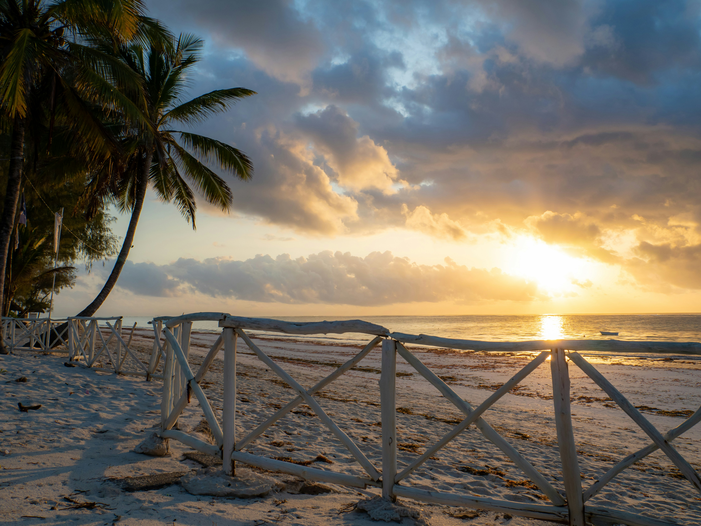

### Overview

Diani is the pause at the end of the journey: white sand and warm water on Kenya's south coast, below Mombasa. In an itinerary, it offers time to recover from early starts, long drives, and safari dust. It is also more than a beach. The Swahili coast has its own history, food, architecture, and culture, with reefs, coastal forest, and protected areas within easy reach.

### Landscape

A long white-sand beach, an offshore coral reef that shelters the water inside the break, coastal forest behind the shoreline, and a wide tidal range that changes the beach throughout the day.

### Wildlife

Reef fish, turtles, and dolphins offshore. Angolan colobus monkeys live in the coastal forest around Diani and are supported by local conservation programmes. Humpback whales pass along this coast between roughly July and September. Inland, Shimba Hills holds sable antelope and elephant.

### Activities

Snorkelling and diving, dhow sailing, kitesurfing, deep-sea fishing, day trips to the marine park south of Diani, visits to a sacred kaya forest, Shimba Hills, and time left deliberately unplanned.

### When to go, and why

December to March is hot, calm, and generally clear. July to October is cooler and drier, with comfortable conditions. April to June brings the long rains, when the coast is wettest and some properties become quieter or close temporarily. For reef activities, tides and sea conditions matter more than the month alone.

### Sample experiences

Three or four nights at the end of a safari, with one day on the reef and the remaining time left open. A dhow trip with lunch on the water.
