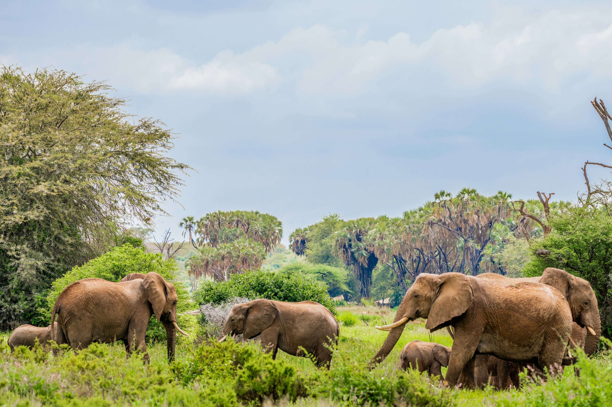
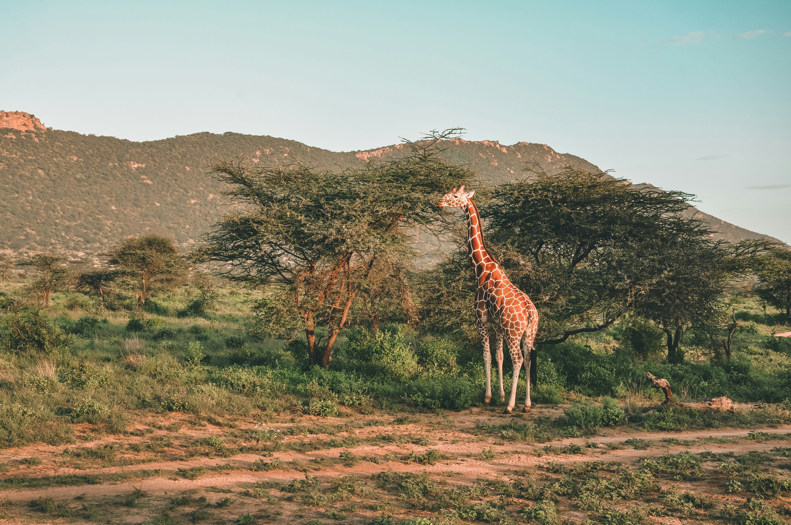
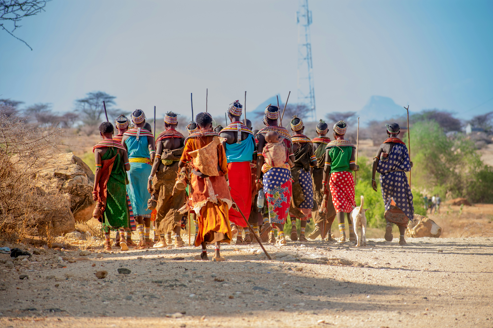

### Overview

North of Mount Kenya, the landscape changes quickly. The country becomes hotter, drier, sharper, and more sculptural. Samburu is a landscape of arid scrub, rock, and red earth held together by the Ewaso Ng'iro, a wide river lined with doum palms. The wildlife is different from the south. For travellers who have already followed a classic safari circuit, or who simply want a less familiar landscape, Samburu is often one of the most memorable parts of the journey.

### Landscape

Dry riverine forest along a broad sandy river, red earth, thorn scrub, and hills along the horizon.

### Wildlife

Five species associated with Kenya's north are often grouped together here: Grevy's zebra, reticulated giraffe, Beisa oryx, gerenuk, and Somali ostrich. Elephant gather along the river, and the reserve also supports lion, cheetah, crocodile, and leopard. Samburu is particularly well known for leopard sightings.

### Activities

Game drives along the river and into the drier interior, birding, and visits to Samburu communities.

### When to go, and why

June to October and December to March are the drier periods. During these months, the river becomes the most dependable source of water across a wide area, drawing wildlife to its banks and making sightings more predictable. Samburu is hot throughout the year, so days are best planned around early mornings and late afternoons.

### Sample experiences

Late afternoon beside the river as elephant herds come down to drink. A morning focused on the northern species that most first-time visitors to Kenya have never seen.
