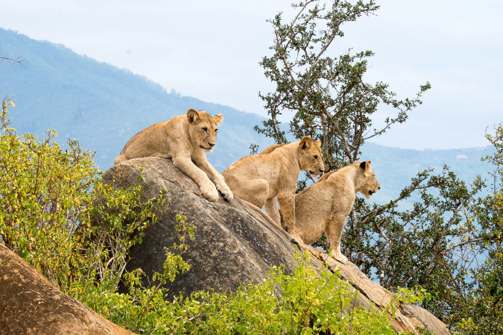
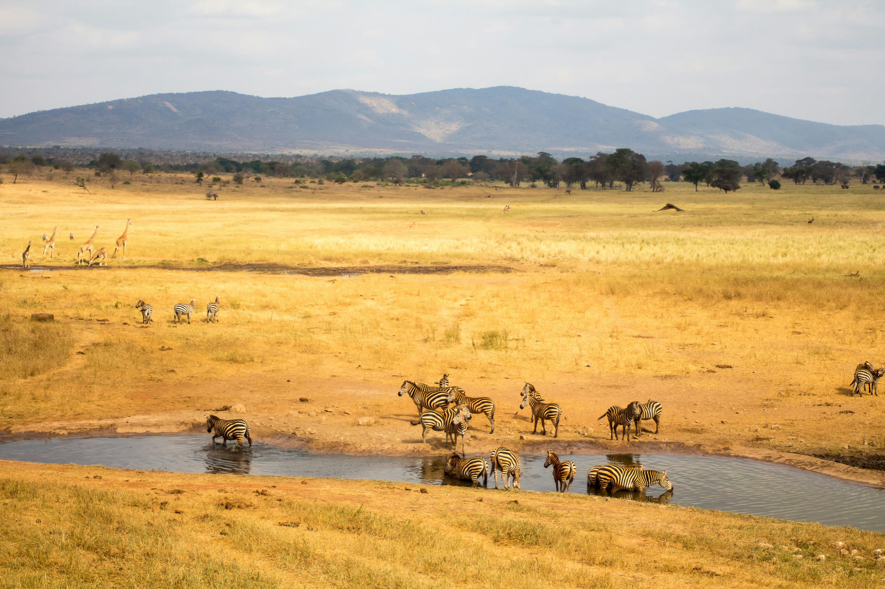

### Overview

Tsavo is vast, and the two parks feel every bit of it. Together they cover roughly 20,800 to 22,000 square kilometres, or about 8,000 to 8,500 square miles: Tsavo East is the larger of the two at around 13,700 square kilometres, with Tsavo West covering the remainder. This is the wilder, emptier, and dustier side of a Kenyan safari. Wildlife can be harder to find than in the Mara because the vegetation is thicker and the distances are greater, but that is precisely the appeal for some travellers. Tsavo also lies between Nairobi and the coast, making it a natural bridge in a safari-and-beach itinerary.

### Landscape

Tsavo East is flatter, drier, and more open, with the Galana River, the long dark line of the Yatta Plateau, and Lugard Falls. Tsavo West is more varied and dramatic, with volcanic hills, the black Shetani lava flow, and Mzima Springs, where clear groundwater emerges beneath the surrounding lava landscape. A submerged viewing chamber allows visitors to look into the water at fish and, when they are nearby, hippo.

### Wildlife

Elephant, often stained red by the local soil, are the defining sight. The parks also hold lion, including the maneless males associated with the region, as well as leopard, buffalo, lesser kudu, gerenuk, and fringe-eared oryx. The fenced Ngulia Rhino Sanctuary in Tsavo West protects black rhino. Birding is strong, particularly during migration periods.

### Activities

Long game drives, the Mzima Springs walk, the Ngulia Rhino Sanctuary, the Shetani lava flow, and viewpoints across the open country.

### When to go, and why

June to October and January to February are generally the easiest months for wildlife viewing. Tsavo is hot and dry, and animals gather around rivers, springs, and waterholes during the dry season, which makes a very large park feel more manageable. The green season brings dramatic skies and richer colour, but wildlife is more dispersed and road conditions can be harder.

### Sample experiences

Two nights in each park: Tsavo West for the landscape, springs, and volcanic features; Tsavo East for open distance and red elephants. A shorter Tsavo stay can also break up the drive from Nairobi to Diani instead of flying over the region.
